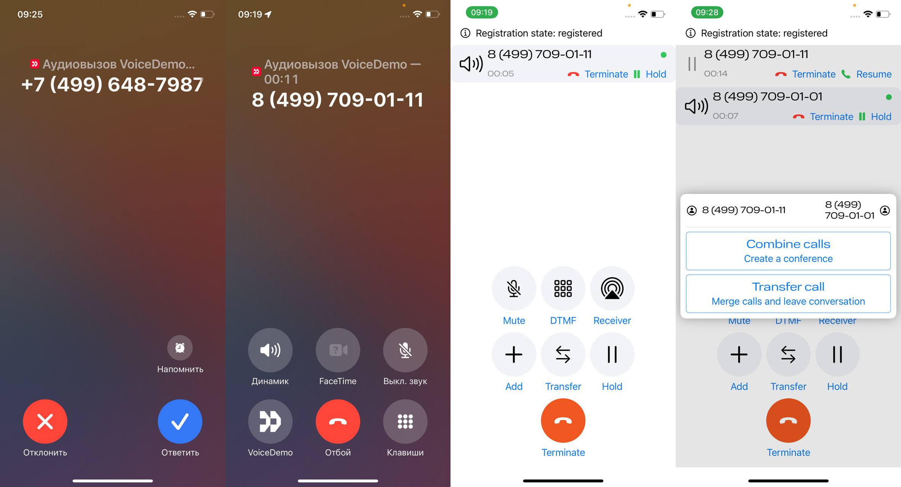

# Exolve iOS Voice Demo
**iOS Voice Demo** - это демонстрационное приложение, которое показывает, как интегрировать [Exolve Mobile Voice SDK](https://docs.exolve.ru/docs/ru/mobile-sdk) в ваш проект. С его помощью вы сможете реализовать исходящие и входящие вызовы в вашем мобильном приложении.

### Возможности iOS Voice Demo:
- исходящий вызов;
- входящий вызов (с использованием Apple VoIP push-уведомлений);
- постановка вызова на удержание и снятие с удержания;
- поддержка нескольких звонковых линий с возможностью переключения между ними;
- создание локальной конференции на устройстве;
- перевод вызова с сопровождением и без;
- интеграция Voice SDK с системным приложением для звонков через [CallKit](https://developer.apple.com/documentation/callkit).

### Подключение Voice SDK в существующий проект Xсode
Возможно 2 способа подключения Voice SDK:
- с использованием Swift Package Manager, для этого необходимо указать https://github.com/mtsexolve/mobile-voice-sdk в качестве URL репозитория пакета, этот способ используется в данном примере;
- с использованием CocoaPods, для этого необходимо использовать наш репозиторий https://github.com/mtsexolve/ios-voicesdk-pods.

### Готовая сборка iOS Voice Demo
Вы можете установить это демонстрационное приложение на свое устройство через [TestFlight](https://testflight.apple.com/join/pnzP2EQg).
Для настройки входящих вызовов с использованием
сборки из TestFlight необходимо указать [сертификат для VOIP пуш уведомлений](./distribution/voippush.p12) во время настройки Mobile Voice SDK на портале [МТС Exolve](https://dev.exolve.ru). 
Для помощи обратитесь в нашу техническую поддержку. 

### Сборка iOS Voice Demo 
Сделайте клон этого репозитория и откройте его в Xсode.

Для запуска на устройстве потребуется доступ к [учетной записи разработчика Apple](https://developer.apple.com), где будет создан профиль приложения с поддержкой push-уведомлений и сертификаты для подписи приложения и отправки push нотификаций (это нужно для получения входящих вызовов, когда приложение неактивно).

Вы можете также запустить проект на симуляторе.

### Подготовка iOS Voice Demo к работе
Для того чтобы начать совершать звонки требуется настроенная SIP учетная запись на портале [МТС Exolve](https://dev.exolve.ru). Более детальная инструкция по настройке доступна по [ссылке](https://community.exolve.ru/faq/kak-podklyuchit-sip-mts-exolve).
